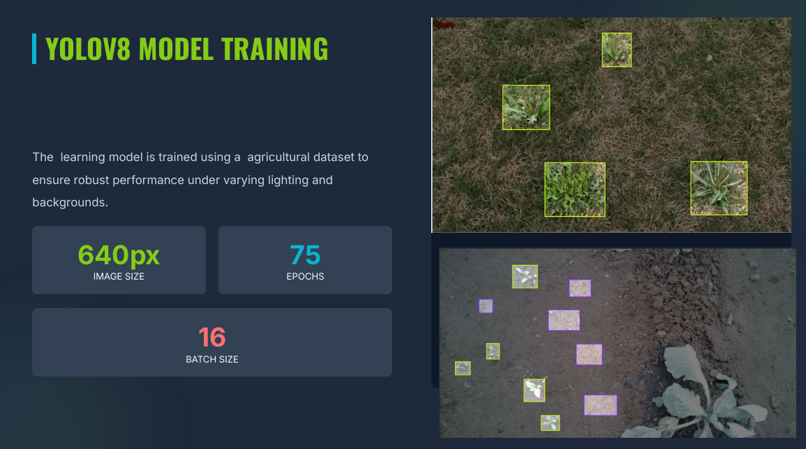
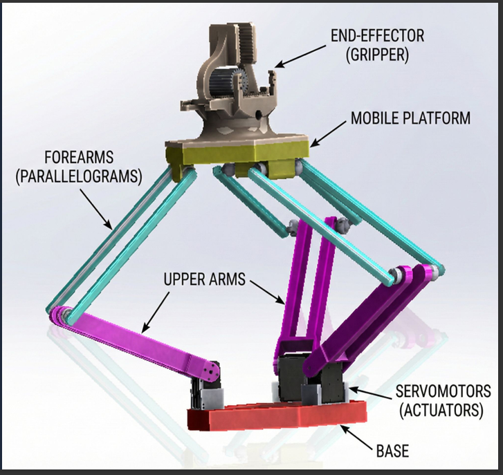
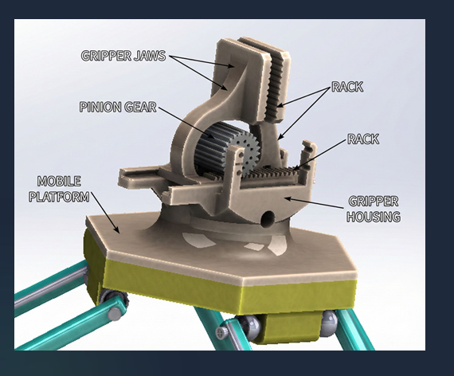
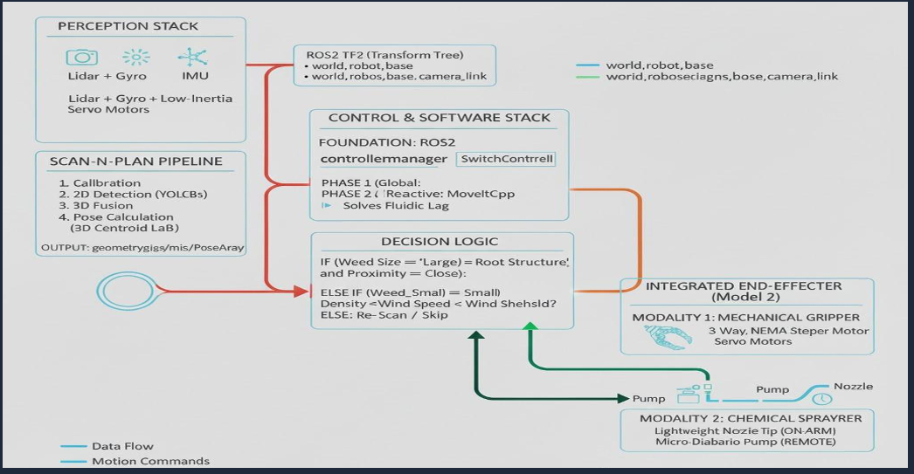

# Dual-Mode Weeder AMR — Research Overview

This repository presents the overview of a Dual-Mode Autonomous Mobile Robot (AMR) designed for precision weed removal in agricultural environments.

The system integrates perception, manipulation, and navigation to selectively remove weeds using a hybrid toolhead capable of both mechanical extraction and targeted chemical spraying.

The project is being developed as part of an academic research effort exploring autonomous agricultural robotics and intelligent field manipulation.

---

## System Motivation

Conventional weed control methods rely either on mechanical removal, which may damage crops, or chemical spraying, which can cause environmental harm.

This project investigates a hybrid robotic solution capable of:

- Detecting weeds using vision-based perception  
- Localizing targets in the robot frame  
- Planning manipulator motion  
- Executing removal using the most suitable method  

The goal is to improve precision, reduce chemical use, and enable scalable automated field maintenance.

---

## System Architecture

The robot consists of the following major subsystems:

### Perception Layer
- Vision-based weed detection using deep learning models  
- Conversion of image detections into real-world coordinates  

---

### Manipulation Layer
- Lightweight delta robot manipulator  
- Motion planning using ROS 2 and MoveIt2  
- Dual-mode toolhead supporting mechanical removal and chemical spraying  

  

---

### Control Pipeline
- ROS 2-based integration of perception, planning, and actuation  
- Modular control stack enabling real-time response  

---

## Research Scope

This project explores:

- Autonomous precision agriculture robotics  
- Mobile manipulation in semi-structured environments  
- Vision-driven target localization  
- Hybrid actuation strategies for selective intervention  

The system serves as a platform for studying intelligent agricultural automation and human-scale robotic field assistance.

---

## Research Status

This repository provides a high-level overview of the system design and research direction.

The full implementation, experimental modules, and development code are maintained in a separate private repository while the project progresses toward publication.

Selected results, demonstrations, and datasets may be released publicly at later stages of the research.

---

## Authors

Adithya Pothula  
Siddanth Bhogoju  
Revu Danusith Kumar  

---

## Research Area

Precision Agriculture Robotics  
Autonomous Mobile Manipulation  
Field Robotics and Smart Farming
